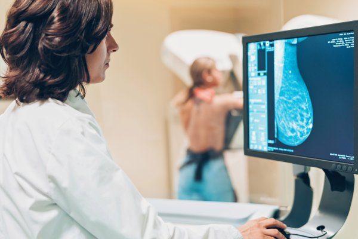
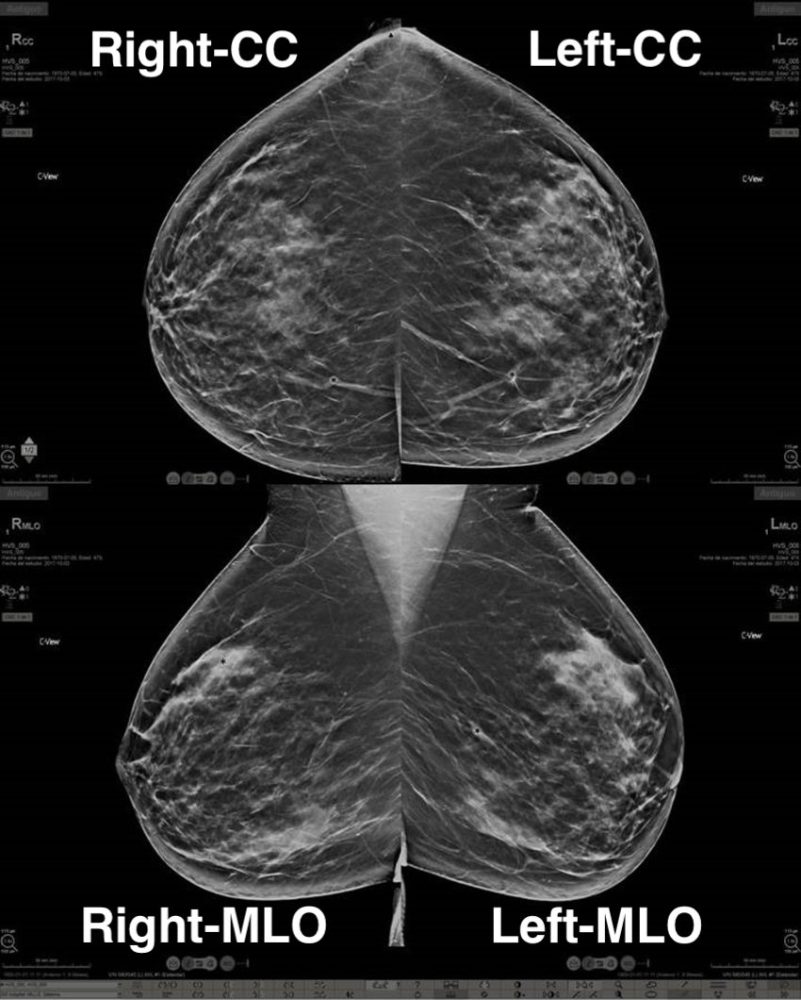
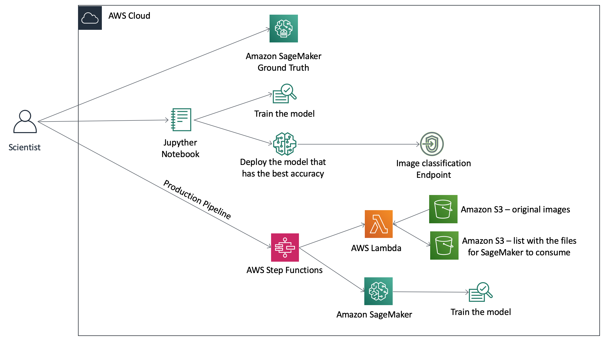
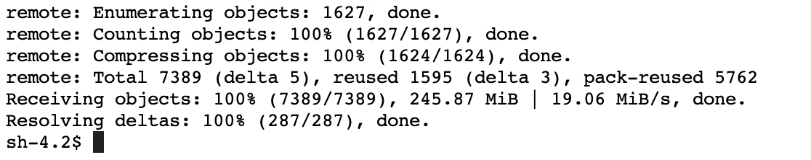
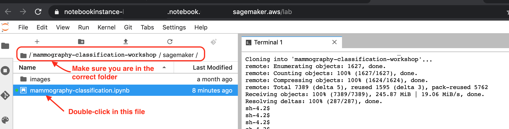
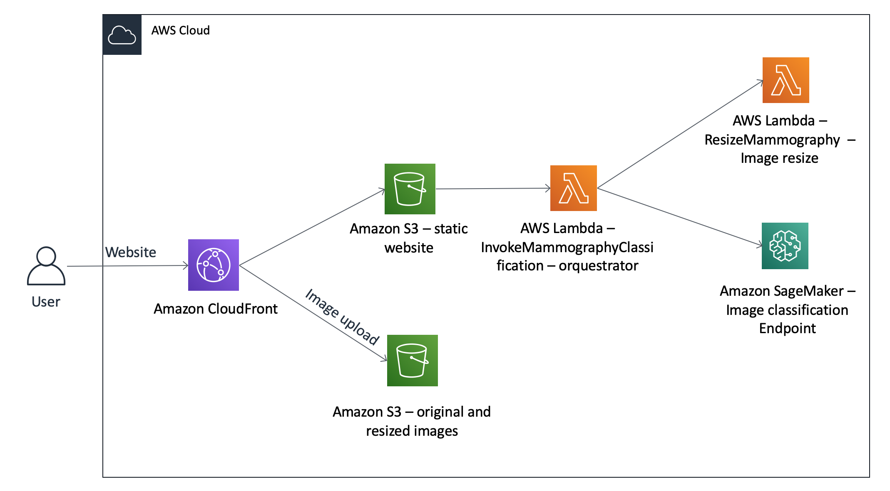

# Amazon SageMaker Mammography Classification Workshop

## Our classification challenge

Mammography (also called mastography) is the process of using low-energy X-rays to examine the human breast for diagnosis and screening. The goal of mammography is the early detection of breast cancer, typically through detection of characteristic masses or microcalcifications.



There are 2 most common views for a mammography exam:

- craniocaudal view (aka CC view)
- mediolateral oblique view (aka MLO view)

The CC view is the exam taken when the machine scans the breast *horizontally*.
The MLO view is the exam taken when the machine scans the breast *vertically*.

Each view contains one picture for the left breast and one for the right breast.
So, for a common exam, we have at least four pictures:

- Left-CC
- Right-CC
- Left-MLO
- Right-MLO

#### How to set a CC and MLO apart?
In an MLO, it is usually possible to identify armpit muscle; sometimes even part of the belly of the patient. As you can see in the example below:




**Note from the author:** *Please note that some words in this module **are not** medical terms. They are being used here for the purpose of elucidation.*

Around 20% of exam images are misdiagnosed. The percentage varies by country and cause, and reflections of that might be damaging to the patient's health. 
<br>
Our challenge for this workshop is to prevent misclassification of images, that could cause the system to spend more money on retaking those exams or possibly leading to a misdiagnosis.

## So, let's begin!


[1 - Creating the SageMaker Jupyter Notebook](#1---creating-the-sagemaker-jupyter-notebook)

[2 - Ground Truth](#2---ground-truth)

[3 - Training, testing, and deploying the Mammography Classification model](#3---training-testing-and-deploying-the-mammography-classification-model)

[4 - Front end](#4---front-end)

[5 - Step Functions](#5---step-functions)

[6 - Clean Up](#6---clean-up)

[7 - Reference Links](#7---reference-links)


Today we will learn how to classify mammography images into 5 different categories using Amazon SageMaker, Amazon GroundTruth, AWS StepFunctions, AWS Lambda, and much more!

You will need to use an AWS account for this workshop, and all information will be provided through this documentation.

**Let's begin!**

To get started, you will need an IAM user with permissions on the following services:
- CloudFormation
- CloudFront
- S3
- IAM
- Cognito
- Lambda
- SageMaker
- StepFunctions

*Pre-requirements:*
- Service limit of 1 SageMaker ml.t2.large instance for a Jupyter Notebook
- Service limit of 1 SageMaker GPU instance type (ml.p2.xlarge, ml.p3.xlarge, etc) for training the model
- Service limit to create 3 Amazon S3buckets
- Service limit to create 1 Amazon VPC

*This lab has been tested in the following regions:*
- N. Virginia (us-east-1)
- Ohio (us-east-2)
- Oregon (us-west-2)
- Ireland (eu-west-1)

## 1 - Creating the SageMaker Jupyter Notebook

Before we can start the workshop, we need to have a SageMaker Jupyter Notebook deployed in your account. The CloudFormation below will also create a bucket for the files needed for this workshop.
<br/>
And, finally, it will create a file inside that S3 bucket that contains a zip of OpenCV lib to be used in *Module 4 - Front End* of this workshop.

**CloudFormation**
1. <a id="raw-url" href="https://github.com/aws-samples/mammography-classification-workshop/blob/master/sagemaker_template.yml">Right-click here</a> and **save link as** to save the **sagemaker_template.yml** template file you are going to use to deploy the basic infrastructure for this workshop.
1. Login in the [AWS Console](https://console.aws.amazon.com/console/home). Make sure you are in the correct region assigned for this workshop.
1. Navigate to CloudFormation console: [https://console.aws.amazon.com/cloudformation/home](https://console.aws.amazon.com/cloudformation/home)
1. Once there, choose **Create Stack**.
1. On "Step 1 - Create Stack", choose **Upload a template file**, then click on the **Choose file** button.
    1. Choose the template file you downloaded in Step 1. Click **Next**
1. On "Step 2", type in the stack name: **mammography-workshop-set-up** . Click **Next**
1. On "Step 3 - Configure stack options": Just click on **Next** button
1. On "Step 4 - Review": Enable the checkbox **I acknowledge that AWS CloudFormation might create IAM resources with custom names.**, and click on **Create Stack** button

Move on to the next part of the Lab.

## 2 - Ground Truth

Let's navigate to the [Ground Truth lab](groundtruth#sagemaker-ground-truth).

## 3 - Training, testing, and deploying the Mammography Classification model

The architecture below represents what we will deploy today:



In order for us to do that, we will need to open the Jupyter Notebook created in step 1.

1. Open the SageMaker Notebook console at https://console.aws.amazon.com/sagemaker/home#/notebook-instances
2. Click on **Open JupyterLab**
3. In the Jupyter Lab console, open **Git menu** and then click on **Open Terminal**. Execute the code below in the terminal:
```
cd SageMaker
git clone https://github.com/aws-samples/mammography-classification-workshop.git
   
 ```
If successful, you should see a message like this:



4\. Now we will upload the mammography images from your local file into the S3 bucket your created in Module 1 of this workshop.
 Those files will be necessary for us to train, test, and validate our model.

5\. In order for us to do that, execute the following command:  

 (**Note: Don't forget to change the bucket name for the name of the bucket created previously**.)

    
    cd mammography-classification-workshop/mammography-images
    
    aws s3 sync . s3://mammography-workshop-files-YY-YYYY-YY-XXXXXXXXXXXX

6\. In the File Browse on the left, navigate to the folder mammography-classification-workshop/sagemaker. You should see something like the image below. Open the notebook with the name mammography-classification.ipynb:

    


7\. Now, follow the instructions described in the notebook.  

## 4 - Front end

After you've finished every step of Module *3 - Training, testing, and deploying the Mammography Classification model*, it's time to see it in action.

We will now deploy a front-end static application in order for us to test our model.

The client application architecture is depicted below:




1. Go back to the Git terminal you opened previously. 

2. Now navigate to the **deploy** folder:
    ```
    cd ~/SageMaker/mammography-classification-workshop/deploy/
    ```
3. Run the deploy script. 
    ```
    ./deploy.sh create 
    ```
4. Copy the Client URL from the script output.
It will look something like this: 


d12yz34h5w67br.cloudfront.net


This is an URL for the AWS content delivery network called Amazon CloudFront. **If you get an error accessing the page, wait a few more minutes and refresh your page.** It might take some time for CloudFront to propagate your site to its edge locations. 


5\. Open the URL in a browser, upload a mammography image and see the results!
If you don't have one already, download a sample mammography image here: 

* [CC-Right](https://mammography-workshop.s3.amazonaws.com/sample/RIGHT_CC.jpg?raw=true)
* [CC-Left](https://mammography-workshop.s3.amazonaws.com/sample/LEFT_CC.jpg?raw=true)
* [MLO-Right](https://mammography-workshop.s3.amazonaws.com/sample/RIGHT_MLO.jpg?raw=true)
* [MLO-Left](https://mammography-workshop.s3.amazonaws.com/sample/LEFT_MLO.jpg?raw=true)
* [Not a mammography](https://mammography-workshop.s3.amazonaws.com/sample/not-a-mammography.png?raw=true)


## 5 - Step Functions

Once you have finished deploying your ML model, it might be necessary to retrain the model from time to time, as new data becomes available. So, we will create an automated workflow for this task.

Let's navigate to the [Step Functions lab](workflow#ml-workflow) to learn how to do that using Step Functions and Lambda.


## 6 - Clean Up
### Attention!
This will delete everything created during this workshop, which includes:
* The front-end
* The back-end
* All Amazon S3 buckets
* The inference endpoint
* The Jupyter Notebook 
* etc.

1. In the notebook Terminal, run the deploy script, but now with **delete** parameter:
    ```
    cd ~/SageMaker/mammography-classification-workshop/deploy/
    ./deploy.sh delete
    ```
    This might several minutes to finish, since it will delete CloudFront distribution. 
  
    
## 7 - Reference Links
* AWS CLI: https://docs.aws.amazon.com/cli/latest/userguide/cli-chap-install.html
* Python boto3: https://boto3.amazonaws.com/v1/documentation/api/latest/index.html?id=docs_gateway
* SageMaker: https://docs.aws.amazon.com/sagemaker/latest/dg/gs.html

* We would like to credit the [DDSM project](http://www.eng.usf.edu/cvprg/Mammography/Database.html) as the source of the mammography images, and reference:
- The Digital Database for Screening Mammography, Michael Heath, Kevin Bowyer, Daniel Kopans, Richard Moore and W. Philip Kegelmeyer, in Proceedings of the Fifth International Workshop on Digital Mammography, M.J. Yaffe, ed., 212-218, Medical Physics Publishing, 2001. ISBN 1-930524-00-5.
- Current status of the Digital Database for Screening Mammography, Michael Heath, Kevin Bowyer, Daniel Kopans, W. Philip Kegelmeyer, Richard Moore, Kyong Chang, and S. MunishKumaran, in Digital Mammography, 457-460, Kluwer Academic Publishers, 1998; Proceedings of the Fourth International Workshop on Digital Mammography.

## License Summary
This sample code is made available under the MIT-0 license. See the LICENSE file.
