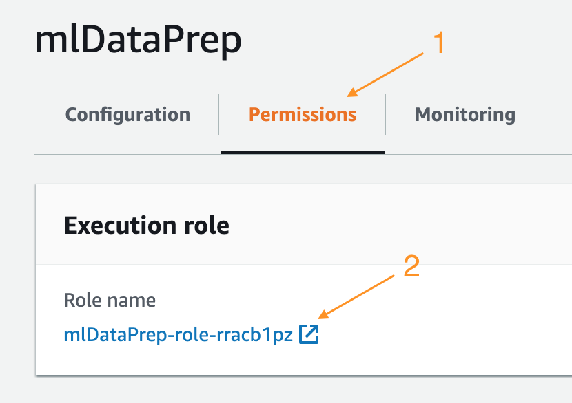

# ML Workflow

## SageMaker Workflows

Now we will create an ML Workflow to retrain the model.

SageMaker has integration with some orchestration tools such as AWS Step Functions and Apache Airflow.
In this workshop, we will use Step Functions to prepare, train, and save our machine learning model.

The workflow steps will look like the figure below:

- **Generate Dataset**: Invokes a lambda function responsible for reading the folder and file structure in S3 and generating a LST file containing the necessary metadata.
- **Train Model**: Creates and runs a training job in SageMaker.
- **Save Model**: Saves the model for later use. The model should be tested before putting into production, so this automation template will not deploy the model in production. You can adjust this according to your rules. 

## Dataprep using Amazon Lambda

Before we can create our workflow, we need to create the Lambda function responsible for generating the metadata files.

**Step 1:** Go to the Lambda console and create a new function from scratch, as follows:

**Step 2:** Once you have created your function, click on it:

**Step 3:** Click on the **Permissions** tab, then click on the role name "mlDataPrep-role-xyz role". It will open a new window.

**Step 4:** Click "Attach Policies", select the AmazonS3FullAccess policy, and click "Attach Policy".

**Step 5:** Now return to your Lambda function. Click on the **Configuration** tab.

Scroll down until you find the **Basic Settings** box. Click on the **Edit** button: 

Change the Timeout to 15 minutes and click on **Save**:

**Step 6:** The last step to finalize our function is to modify the source code. Download the source code [here](code/generate_lst_lambda_template.py?raw=True) and paste it into the "Function Code" field.

It should look something like this:

**Step 7:** Then click **Save** and then **Test**. Don't change anything in the test pop-up, just add an **Event Name** and click **Create**:
 

Click **Test** again to effectively run the test. 
 
Check the function output logs. If successful, you will see the following message:

## Workflow definition using AWS Step Functions

Now that you have your Lambda function ready, you can create your Workflow.

**Step 8:** Go to the [Step Functions console](https://console.aws.amazon.com/states/home) and create a new State Machine by clicking on "State Machines" / "Create state machine" on the menu on the left.

**Step 9:** Download/Open the workflow definition file [here](code/model_workflow_template.json?raw=True) and paste the contents into the "Definition" field.
It should look something like this:

**Step 10:** Click the "refresh" button in the picture to see the graphical representation of your workflow. It should look like the following image:

**Step 11:** In the code you just copied inside the "Definition" field, replace the following information:

- "Resource": "<<arn_of_your_lambda>>"

    [Click here](https://console.aws.amazon.com/lambda/home?/functions/mlDataPrep#/functions/mlDataPrep?tab=configuration) to open the Configuration tab of your lambda function. On the top right corner, you will find the Lambda's function ARN.
- "TrainingImage": "<<training_image_URL>>"
    Replace the training image URL according to your region:
    - N. Virginia (us-east-1): replace by "811284229777.dkr.ecr.us-east-1.amazonaws.com/image-classification:latest"
    - Ohio (us-east-2): replace by "825641698319.dkr.ecr.us-east-2.amazonaws.com/image-classification:latest"
    - Oregon (us-west-2): replace by "433757028032.dkr.ecr.us-west-2.amazonaws.com/image-classification:latest"
    - Ireland (eu-west-1): replace by "685385470294.dkr.ecr.eu-west-1.amazonaws.com/image-classification:latest"
- "S3OutputPath": "s3://<\<mammography-workshop-files-YY-YYYY-YY-XXXXXXXXXXXX>\>/models"

    The name of the bucket created by the first CloudFormation of this lab. It should start with **s3://mammography-workshop-files-**
    
- "RoleArn": "<<arn_of_your_sagemaker_execution_role>>"

    Navigate to your [notebook instances](https://console.aws.amazon.com/sagemaker/home#/notebook-instances)
    There, click on the instance created for this lab. In the **Permissions and encryption** field, you will see **IAM role ARN**. Copy that value and paste here. You will need this information below again.
     
- "S3Uri": "s3://<\<mammography-workshop-files-YY-YYYY-YY-XXXXXXXXXXXX>\>/resize/train/"

    Same as above.
- "S3Uri": "s3://<\<mammography-workshop-files-YY-YYYY-YY-XXXXXXXXXXXX>\>/resize/test/"

    Same as above.
- "S3Uri": "s3://<\<mammography-workshop-files-YY-YYYY-YY-XXXXXXXXXXXX>\>/resize/train-data.lst"

    Same as above.
- "S3Uri": "s3://<\<mammography-workshop-files-YY-YYYY-YY-XXXXXXXXXXXX>\>/resize/test-data.lst"

    Same as above.
- "Image": "<<training_image_URL>>" 

    Replace the training image URL according to your region:
    - N. Virginia (us-east-1): replace by "811284229777.dkr.ecr.us-east-1.amazonaws.com/image-classification:latest"
    - Ohio (us-east-2): replace by "825641698319.dkr.ecr.us-east-2.amazonaws.com/image-classification:latest"
    - Oregon (us-west-2): replace by "433757028032.dkr.ecr.us-west-2.amazonaws.com/image-classification:latest"
    - Ireland (eu-west-1): replace by "685385470294.dkr.ecr.eu-west-1.amazonaws.com/image-classification:latest"

- "ExecutionRoleArn": "<<arn_of_your_sagemaker_execution_role>>"

    Paste here the same information of "RoleArn" above.
    
    
**Step 12:** Now click "Next". Fill out the fields as the image below, leaving the rest as default. Click "Create state machine".

Congratulations! You have created your first Machine Learning Workflow. 

**Step 13:** To test it, click "Start execution". The workflow should take about 10 minutes to complete. If successful, at the end you will see the following image, with all the steps colored in green:

**Step 14:** Scroll down to the **Execution event history** session. One of the outputs is your newly created AI model:

Click the **SageMaker Model** link to open a new tab with the details of the model, including its location in Amazon S3.

Scroll down until you find a link to the training job. Click on it:

It will open a new tab. Scroll down until you find ** Monitor**. Click on **View algorithm metrics ** link:

When the tab opens, you can check all metrics and on the Graphed Metrics, choose **Maximum** to see the highest accuracy metrics found.

Place the mouse cursor over the metric in the graph to see the highest results found:

Additionally, to see the logs generated by your training job, you can go back to the **Monitor** section in the Training Job window and click on the **View Logs** link:

After clicking in the name of the log, you should be able to see something like this:

If you are satisfied with the Accuracy results, you can now deploy you model/endpoint into production.

Let's go back to the lab by clicking [here](/../../#5---step-functions)